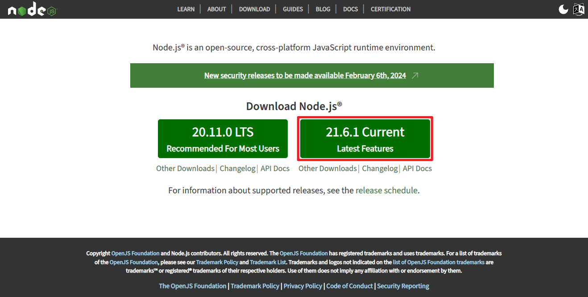
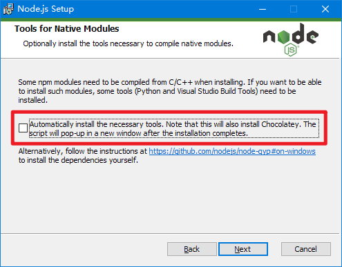
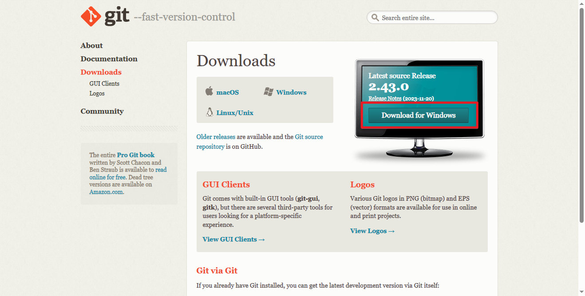
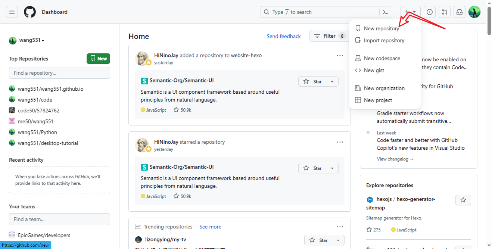

使用 Hexo “快速”搭建一个博客,并使用炫酷的主题。  
心动了吗？跟我来！  
<!--more-->
# 安装并配置 Hexo
## 前提
首先你需要安装 Node.js、Git。
### Node.js
官网在此 [https://nodejs.org/](https://nodejs.org/) https://nodejs.org/  
  
下载最新版本,然后一路 Next 即可。  

第四步时有一个选项：   
如果你选上的话,安装窗口关闭后会跳出一个 CMD 窗口,给你安装其他工具。我的建议是：不选。毕竟要消耗额外的 3 Gib 的空间,在本教程中是无需这些工具的,所以你完全可以不选,但是你有其他需求的话看你需要。


### Git
官网在此 [https://git-scm.com/downloads](https://git-scm.com/downloads)  
  
同样也是下载最新版本,一路 Next。


## 安装 Hexo
安装完成后,就开始安装 Hexo：
```bash
npm install -g hexo-cli
```
然后就安装完成了。

## 配置 Hexo
要把 Hexo 调教成你的样子,修改配置文件是必不可少的,Hexo 的配置在博客目录下的 `_config.yml` 文件内,你可以通过修改此文件来配置 Hexo。  
``` yml
# Site
title: Hexo       # 这是网站的标题,起一个你喜欢的标题
subtitle: ''      # 
description: ''
keywords:
author: John Doe  #作者
language: en      # 改为 zh-CN 即可
timezone: ''      # 时区,中国大陆地区可以使用 Asia/Shanghai.
```

现在已经差不多了,先启动本地服务器,运行 `hexo server`,然后访问 `http://localhost:4000`,可以看到,一个简单的博客已经在本地建好了.  

但是,**注意**啊,是本地,你只能在本地访问.  

# 部署到 GitHub Pages
如果想要其他人可以访问你的网站,你可以将它放到一个静态托管网站上,GitHub Pages 就是一个不错的选择,第一,他免费;第二,他方便;但是,它加载慢.  
不过问题不大,你可以选其他的托管平台,本教程先以此为例,原理都是差不多的.  

## 账号
GitHub 账号是必须的,什么? 你没有?  
**那就快去[注册](https://github.com/signup)**  

## 上传到远程仓库
  


# 更换主题
## 安装 Fluid
在博客目录执行
```bash
npm install --save hexo-theme-fluid
```
然后修改 Hexo 配置文件,指定主题为 Fluid。
```yaml
# ./_config.yml
theme: fluid  # 指定主题

language: zh-CN  # 指定语言,会影响主题显示的语言,按需修改
```

## 配置 Fluid
这里要先说一下配置文件的优先级  
官网这样解释：  

Hexo 在合并主题配置时,Hexo 配置文件中的 theme_config 的优先级最高,其次是 _config.[theme].yml 文件,最后是位于主题目录下的 _config.yml 文件
  
也就是说,你在修改主题配置的时候,只需要把主题文件夹相应部分复制到`/_config.fluid.yml`内然后修改就可以覆盖默认配置了。  

关于 Fluid 的配置这里就不多赘述了,[官网](https://hexo.fluid-dev.com/docs/)有详细的帮助文档。  