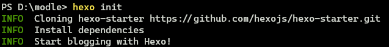
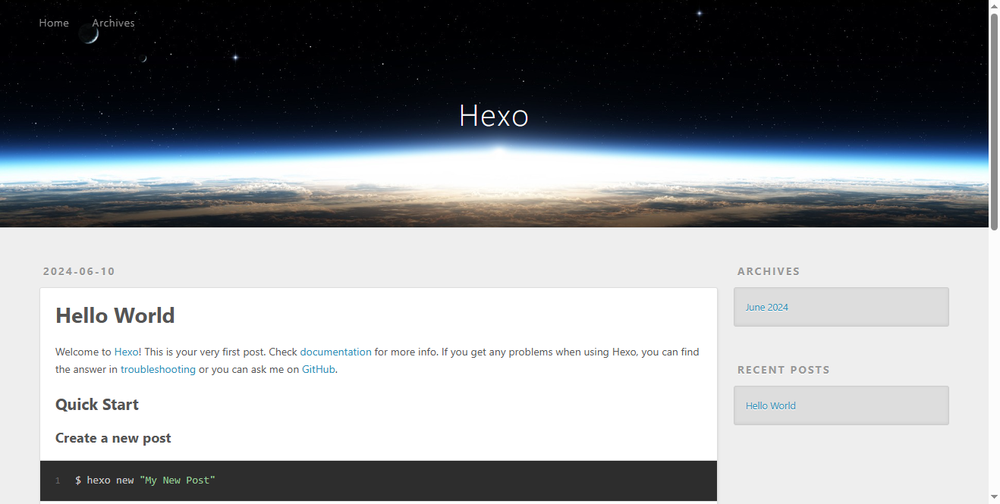

使用 Hexo “快速”搭建一个博客,并使用炫酷的主题.  
心动了吗？快跟我来!  
<!--more-->
# 安装 Hexo
## 前提
首先你需要安装 Node.js、Git.
### Node.js
官网在此 [https://nodejs.org/](https://nodejs.org/) https://nodejs.org/  
  
下载最新版本,然后一路 Next 即可.  

第四步时有一个选项：   
如果你选上的话,安装窗口关闭后会跳出一个 CMD 窗口,给你安装其他工具.我的建议是：不选.毕竟要消耗额外的 3 Gb 的空间,在本教程中是无需这些工具的,所以你完全可以不选,但是你有其他需求的话看你自己.


### Git
官网在此 [https://git-scm.com/downloads](https://git-scm.com/downloads)  
  
同样也是下载最新版本,一路 Next,然后就安装完成了.  

## 安装 Hexo
安装完成后,就开始安装 Hexo：
```bash
npm install -g hexo-cli
```
然后就安装完成了.  

## 初始化
现在,找地方建一个空文件夹(这就是我们的博客目录了),右键在文件夹下运行 terminal,输入`hexo init` 进行初始化,

这样就OK了.  
你可以先运行 `hexo s` 看一下.  

这个是默认的主题,你可能会不喜欢,接下来我们来换一个酷酷的主题.

# 更换主题
[https://hexo.io/themes/](https://hexo.io/themes/)  
这个网站是 Hexo 的主题展示页面,上面收录了很多主题,我选的是 Fluid,其中一个原因是他官方的文档非常详细,方便我~~抄~~写教程,接下来我会介绍如何配置.  

## 安装主题
在博客文件夹打开终端,运行以下命令,它会安装主题.
```bash
npm install --save hexo-theme-fluid
```
然后修改 Hexo 配置文件(也就是你博客目录下的 `_config.yml` 文件),指定主题为 Fluid.
```yaml
# ./_config.yml
theme: fluid  # 指定主题为fluid
language: zh-CN  # 指定语言,会影响主题显示的语言,按需修改
```

要知道,现在你的博客目录下会有好几个配置文件,_config.yml 是 Hexo 的全局的配置文件, _config.[主题名称].yml 是主题的配置文件,一般不同的主题内容会有所不同.  
一般来说,修改主题相关的配置时,改主题配置文件就好.  
更多请看 [使用代替主题配置文件](https://hexo.io/zh-cn/docs/configuration#%E4%BD%BF%E7%94%A8%E4%BB%A3%E6%9B%BF%E4%B8%BB%E9%A2%98%E9%85%8D%E7%BD%AE%E6%96%87%E4%BB%B6)

然后再运行 `hexo s` 看一下.  
 
很好,但是,你会发现,网站的标题什么的还是 Hexo 默认的,要做自己的网站,怎么能没有个性呢?
接下来,我们要对它进行修改.

## 配置主题
你可能会疑问要改哪个配置文件,我的答案是:都差不多.  
这是官网的解释,  

我们强烈建议你将所有的主题配置集中在一处。 如果你不得不在多处配置你的主题，那么这些信息对你将会非常有用：Hexo 在合并主题配置时，Hexo 配置文件中的 theme_config 的优先级最高，其次是 _config.[theme].yml 文件。 最后是位于主题目录下的 _config.yml 文件。
 
所以说,改哪个文件,最终都会合并成一个配置文件.  
我比较喜欢在 `_config.yml` 文件修改和博客相关的内容,比如网站标题,等等;对于主题相关的配置,我会修改 `_config.[theme].yml` 文件,这样以后换主题的时候会方便一点.
首先,我们要改的是,Hexo 的配置在博客目录下的 `_config.yml` 文件内,你可以通过修改此文件来配置 Hexo.  
``` yml
# Site
title: Hexo       # 这是网站的标题,起一个你喜欢的标题
subtitle: ''      # 副标题
description: ''   # 描述
keywords:
author: John Doe  #作者
language: en      # 改为 zh-CN 即可
timezone: ''      # 时区,中国大陆地区可以使用 Asia/Shanghai.
```
然后我们再来改一下主题的配置,如果你博客目录下没有 `_config.fluid.yml` 文件,你要新建一个,然后吧这个链接的内容复制进去:[_config.yml](https://github.com/fluid-dev/hexo-theme-fluid/blob/master/_config.yml),这里面是 fluid 的所有配置,你可以去[配置指南](https://hexo.fluid-dev.com/docs/guide/)查看详细信息,然后按需修改.
现在已经差不多了,先启动本地服务器,运行 `hexo server`,然后访问 `http://localhost:4000`,可以看到,一个简单的博客已经在本地建好了.  
**但是**,注意啊,是**本地**,你只能在本地访问.  

# 部署到 GitHub Pages
如何在网络上访问这个网站呢?你可以将它放到一个静态托管网站上,GitHub Pages 就是一个不错的选择,第一,他免费;第二,他方便;但是,它加载慢.  
不过问题不大,你可以选其他的托管平台,本教程先以此为例,原理都是差不多的.  

## 账号
GitHub 账号是必须的,什么? 你没有?  
**那就快去[注册](https://github.com/signup)!!**  

## 上传到远程仓库
  


# 更换主题
## 安装 Fluid
在博客目录执行
```bash
npm install --save hexo-theme-fluid
```
然后修改 Hexo 配置文件,指定主题为 Fluid.
```yaml
# ./_config.yml
theme: fluid  # 指定主题

language: zh-CN  # 指定语言,会影响主题显示的语言,按需修改
```

## 配置 Fluid
这里要先说一下配置文件的优先级  
官网这样解释：  

我们强烈建议你将所有的主题配置集中在一处。 如果你不得不在多处配置你的主题，那么这些信息对你将会非常有用：Hexo 在合并主题配置时，Hexo 配置文件中的 theme_config 的优先级最高，其次是 _config.[theme].yml 文件。 最后是位于主题目录下的 _config.yml 文件。
  
也就是说,你在修改主题配置的时候,只需要把主题文件夹相应部分复制到`/_config.fluid.yml`内然后修改就可以覆盖默认配置了.  

关于 Fluid 的配置这里就不多赘述了,[官网](https://hexo.fluid-dev.com/docs/)有详细的帮助文档.  

# 参考
[1] https://hexo.io/zh-cn/docs/
[2] https://hexo.fluid.io